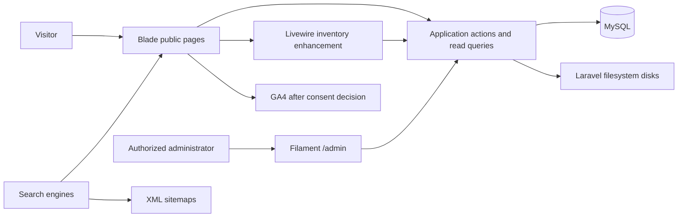

# Application architecture

## Architectural style

Use a single Laravel application with clear domain boundaries, server-rendered public pages, and one private administration panel. A separate API, SPA, search service, or microservice adds no current value. Eloquent models remain the persistence layer; query scopes/query objects handle inventory reads, while transactional application actions enforce stock generation, publication, status changes, duplication, and media deletion.

## Responsibility boundaries

| Boundary | Owns | Must not own |
|---|---|---|
| Inventory | Cars, publication, lifecycle, stock numbers, related-car selection | Contact facts or legal copy |
| Catalog taxonomy | Makes, models, body types, features, controlled values | Vehicle-specific marketing descriptions |
| Media | Validation, processing state, variants, disk/path, safe deletion | Provider-specific URLs in domain records |
| Content | Fixed-key pages, guides, FAQs, car-stand editorial content | Arbitrary route creation or an unrestricted page builder |
| Settings | Typed contact, hours, social and reservation values | Secrets or duplicated long-form policies |
| Administration/audit | Authentication, policy checks, privileged workflows, immutable logs | Business rules embedded only in UI resources |
| Analytics | Allowlisted interaction events and aggregate reporting | Conversations, call outcomes, customer identity, or sales attribution |

## Stack responsibilities

### Laravel and Blade

Laravel owns routing, validation, authorization, persistence, caching, queue/scheduler hooks, filesystems, logging, and error handling. Blade renders initial HTML for every indexable public route, including car results, car details, metadata, JSON-LD, breadcrumbs, pagination links, and useful empty states. Core journeys must remain usable if optional JavaScript fails.

Controllers should remain thin: validate input, invoke a read query/action, then return a view or response. Domain rules belong in dedicated action/service classes and policies. Do not add repository-pattern wrappers around Eloquent unless a real alternate persistence boundary emerges.

### Livewire

Livewire 4 is proposed only for the `/cars` filtering/search experience and small server-state interactions that need it. URL query values are the durable state; the initial response remains server-rendered. Search commits on submit, filters commit through Apply, and sort commits immediately. Livewire must not become a second routing, SEO, or authorization system. It bundles Alpine, so do not install a duplicate standalone Alpine runtime.

### Tailwind CSS

Tailwind 4 implements the existing brand tokens, layout primitives, responsive states, focus states, reduced motion, and accessible component variants. The current repository uses CSS-first Tailwind with `@tailwindcss/vite`; do not introduce a legacy configuration file without a measured need. Public and admin styling may use separate compiled entries if that prevents unused admin CSS from burdening public pages.

### Filament

Filament 5 is the proposed `/admin` panel. Resources expose validated workflows for inventory, media, catalog, content, settings, users, and read-only audit data. Filament's standard resource operations use Laravel policies, while custom actions/pages require explicit authorization. Filament resources call the same domain actions used elsewhere; they do not define an alternative lifecycle.

### MySQL

MySQL is authoritative for structured content, catalog data, inventory, lifecycle history, settings, users, and optional first-party interaction events. Searchable car facts use typed columns and indexes. Rare non-filterable details may use controlled JSON. Database transactions protect stock generation, lifecycle changes, primary-media selection, and audit writes.

The application timezone should be changed from the current `UTC` default to the approved business timezone `Africa/Lagos` during foundation setup. Persist timestamps in UTC and render business deadlines in `Africa/Lagos`; test the 14-day calculation explicitly.

## Public request and publication rules

Public inventory queries use one reusable scope: not soft-deleted, `published_at` is present and not future, and status is permitted by the route. `/cars` defaults to `available`; direct detail pages may expose `available`, `reserved`, or `sold`. Draft returns 404. Archived previously published URLs return 410 unless a deliberate relevant redirect exists.

Publication is an action, not a writable checkbox. It validates all required car fields and a processed primary image, generates or confirms a stable slug, sets `published_at`, changes status to `available`, and appends status/activity records transactionally.

## Media-storage architecture

Persist `disk` and relative `path`, never a full provider URL. Uploads enter private staging, are decoded and re-encoded, then produce public deterministic variants. Store sanitized originals privately where the deployment can support them; public templates receive filesystem-generated URLs for processed assets.

- Local storage is suitable for development and a single durable server.
- Production object storage is preferred for ephemeral or multi-node hosting.
- A later R2/S3 move changes disk configuration and copies objects; domain records remain valid.
- The S3 filesystem adapter is not currently installed and belongs to the authorized storage phase if required.
- Media deletion is authorized, scoped to paths owned by the record, performed after database commit, and delayed through a recovery window.
- Back up database metadata and originals; derivatives should be reproducible.
- CDN cache keys should be immutable/versioned. Replacing media creates a new path rather than overwriting a cached object.

## Content ownership

| Content | Governance source | Runtime source / editor |
|---|---|---|
| Public and legal business names, voice, design rules | `docs/brand` | Typed settings where rendered; Super Administrator |
| Phone, WhatsApp, email, hours, social URLs | Approved business profile | Typed singleton settings; Super Administrator |
| Car-stand address and details | Approved business profile | `car_stands`; Super Administrator |
| Reservation amount and period | Approved business profile | Typed singleton settings; Super Administrator |
| Reservation policy | Approved policy text | Fixed-key `content_pages`; Super Administrator with approval |
| Delivery, About, How to Buy, legal and footer copy | Approved content | Fixed-key `content_pages`; Super Administrator |
| FAQs | Approved answers | `faqs`; authorized content editor |
| Buying guides | Approved articles | `buying_guides`; Super Administrator |
| Vehicle facts, price, status, media | Inventory evidence | Car tables; authorized inventory roles |
| Homepage featured cars | Inventory decision | Derived from published `cars.is_featured` |
| Route/navigation/status definitions | This architecture | Application configuration/code |
| App URL, GA measurement ID, credentials and secrets | Deployment owner | Environment only |

Templates query one runtime source; they must not repeat contact or reservation values as local constants. Brand documents govern approval but are not parsed at runtime.

## Installed environment and compatibility

Verified on 2026-08-29:

| Item | Installed/current | Assessment |
|---|---:|---|
| PHP | 8.4.22 (`composer.json` requires `^8.3`) | Compatible |
| Composer | 2.10.1 | Current dependency resolver |
| Laravel | 13.29.0 (`^13.17`) | Compatible |
| Blade | Laravel built-in | Installed and approved |
| Tailwind CSS / Vite plugin | 4.3.3 / 4.3.3 | Compatible with Filament minimum |
| Vite / Laravel Vite Plugin | 8.2.2 / 3.2.0 | Current build path |
| Node / npm | 22.20.0 / 10.9.4 | Meets installed tooling's effective Node floor |
| Database | MySQL active; SQLite in-memory in tests | MySQL-specific integration coverage is required |
| PHP extensions | PDO MySQL, intl, mbstring, fileinfo, GD | Filament requirements met; Imagick absent |
| Public JS framework | None | Blade-first baseline |
| Authentication UI/package | None | Laravel guard/User foundations only |
| Livewire / Filament | Not installed | Proposed below |

The current root package does not declare a Node engine. Vite/Laravel Vite Plugin effectively require a supported Node 20 release or Node 22.12+, and the installed 22.20.0 satisfies that requirement.

### Proposed package plan

| Package | Future major | Reason and constraint |
|---|---|---|
| `livewire/livewire` | 4.x, resolve at Phase 3 | Official v4 requirements are Laravel 10+ and PHP 8.1+; Filament currently requires Livewire 4.1+ |
| `filament/filament` | 5.x, resolve at Phase 3 | Official v5 requirements are PHP 8.2+, Laravel 11.28+, Tailwind 4.1+, `ext-intl`, and Livewire 4.1+ |
| Permissions dependency | None initially | Two fixed roles are simpler as a controlled user field plus policies |
| Image processing | Deferred | Select only after GD/AVIF, memory, security and variant-output tests |
| S3 adapter | Conditional | Add only if the selected production disk needs it |

No compatibility adjustment is currently required. During Phase 3, resolve current stable patch versions, inspect Composer's plan, run baseline tests/build before and after, and verify any Filament plugin explicitly supports Filament 5. Do not copy Filament's “new project” scaffold over existing brand assets.

Official compatibility references: [Livewire 4 installation](https://livewire.laravel.com/docs/4.x/installation), [Livewire composer constraints](https://github.com/livewire/livewire/blob/4.x/composer.json), [Filament 5 installation](https://filamentphp.com/docs/5.x/introduction/installation), and [Filament security](https://filamentphp.com/docs/5.x/advanced/security).

## Current repository gaps and risks

- Only the starter `/` route and generic welcome view exist; there is no domain layer, admin panel, or public auth flow.
- Starter tests use SQLite and can miss MySQL constraints/index behaviour.
- `public/logo.jpeg` is now present (1080×1080 raster), while the approved brand document says the logo file was absent. Confirm provenance and production approval; transparent, horizontal, compact, vector, and favicon assets remain missing. `public/favicon.ico` is zero bytes.
- No genuine car or car-stand photography is present.
- The app name, README, Composer description, starter seeder, and welcome page remain generic. The later foundation phase must replace development defaults without manufacturing production content or an administrator.
- Queue/session/cache use database-backed defaults; production deployment must run the required workers/cleanup or deliberately reconfigure them.
- Error monitoring, hosting topology, storage provider, backup service, retention, and analytics consent remain deployment decisions.
