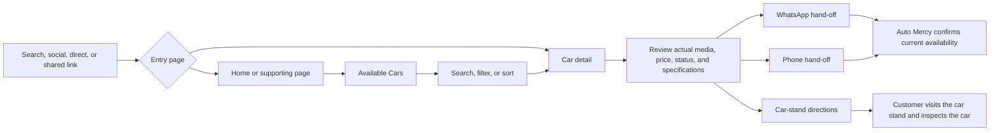
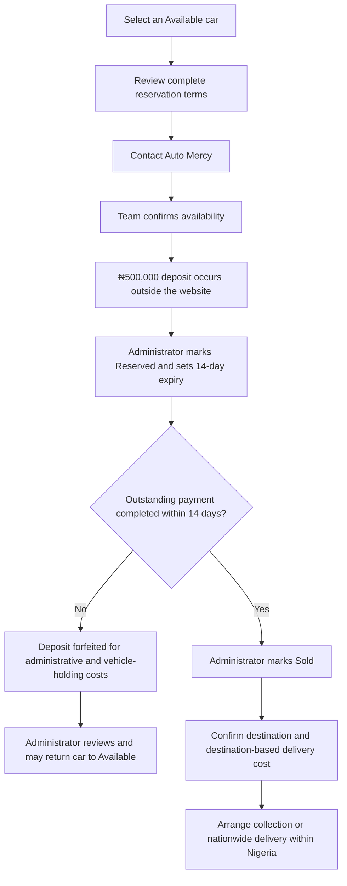
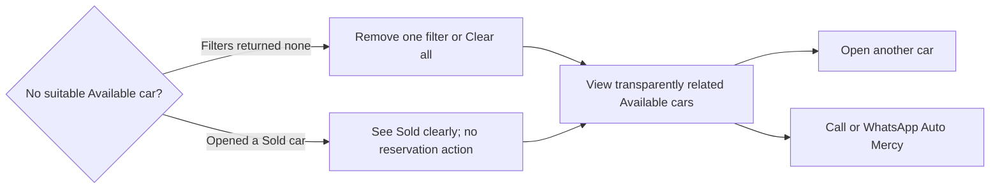

# Customer journeys

Website success means helping a customer evaluate a real car and make a contact or directions hand-off. A click is not proof of a connected call, conversation, visit, reservation, purchase, or delivery.

## Discovery, search and enquiry

## Reservation and delivery

The missed-deadline branch does not trigger a website financial action. At launch, an overdue admin alert prompts a human to confirm the next status and record the reason.

## Empty result and Sold-car recovery

## Journey contract

| Journey | User goal and entry points | Required pages and CTAs | Success and failure/recovery | Admin responsibility | Analytics |
|---|---|---|---|---|---|
| Discovery | Understand the business and find inventory from organic search, social, direct, guide, stand, or shared-car URL | Home/supporting page → Available Cars/detail; Browse Cars, WhatsApp, Call | Reaches useful inventory or a contact action; stale URL offers relevant navigation | Keep facts, inventory, metadata, and links current | Normal `page_view`; `view_car`/`view_car_stand` where applicable |
| Car search | Narrow Available cars from `/cars`, Home, or curated landing | `/cars` → filters/sort → detail; Apply Filters, View Details | Finds a car; zero results expose active criteria, individual removal, Clear all, related cars, and contact | Maintain structured facts and correct publication/status | `search_cars`, `filter_cars`, `view_car` |
| WhatsApp | Ask about Auto Mercy or one car from header, card, detail, contact, or stand | Current page → WhatsApp deep link; alternative visible local number | WhatsApp opened with useful context; failure offers copyable number and Call | Respond outside the website; maintain approved number | `whatsapp_click` only indicates activation |
| Phone | Start a call from header, detail, contact, or stand | Current page → `tel:` action; WhatsApp fallback | Dialler opened; connection/outcome is unknown | Maintain approved number | `phone_click` only indicates activation |
| Visit car stand | Locate and inspect a car at its assigned car stand | Detail/Car Stands/stand/Contact → Directions, Call, WhatsApp | Map hand-off or contact; actual arrival is not inferred | Maintain exact address, hours, stand assignment, and availability | `view_car_stand`, `directions_click`, contact-click event |
| Reservation | Understand terms and hold an Available car | Detail → Reservation overview/policy → contact | Team confirms availability; external deposit; Reserved; later Sold or reviewed after deadline | Mark Reserved, set timestamps/expiry, append audit/status history; later mark Sold or Available | `view_reservation_terms` plus contact click |
| Nationwide delivery | Confirm whether/how a purchased car reaches a Nigerian destination | Detail or delivery page → Call/WhatsApp | Team confirms destination and cost, then arranges delivery after purchase; no fixed online quote | Confirm cost/arrangement outside website and keep car status accurate | `view_delivery_information` plus contact click |
| Empty result | Recover from no match | `/cars` empty state → remove chip, Clear all, related cars, contact | New result set, detail view, or contact hand-off | Investigate unexpected taxonomy/status errors | Existing search/filter event; `select_related_car` when chosen |
| Sold car | Understand stale/shared result and find an alternative | Sold detail → similar Available cars, Browse Cars, contact | Status is unambiguous; no hold action; finds alternative | Set Sold/time promptly, maintain page, perform later retention review | `view_car` with `status=sold`; `select_related_car`; contact clicks |

## Car-specific WhatsApp context

The prefilled message contains year, make, model, trim when present, stock number, and the canonical detail URL. Pattern:

> Hello Auto Mercy, I’m interested in the 2019 Toyota Camry XSE, stock number AM-0001. Is it still available? https://example.invalid/cars/2019-toyota-camry-xse-am-0001

The production host replaces the illustrative host. Encode the text correctly and never store or attempt to read the resulting message or conversation.

## Cross-journey safeguards

- Every availability-dependent CTA reads the same current car status used by visible text and structured data.
- Detail/contact actions identify their destination and preserve keyboard focus behaviour.
- Reservation and delivery wording is available before contact, not hidden behind an interaction.
- A failure to open an external app leaves visible contact information and a usable alternative.
- Analytics reports “views” and “clicks”; operational teams decide outcomes outside the site.
