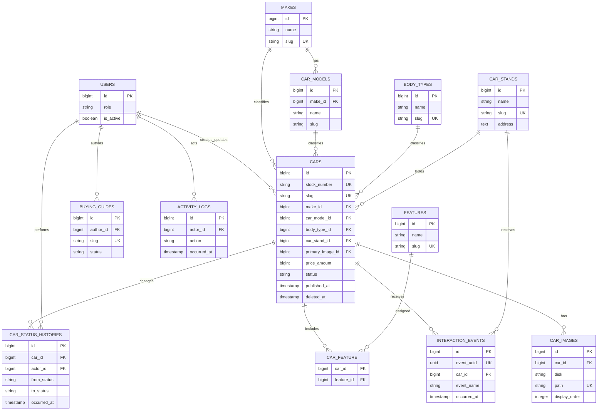
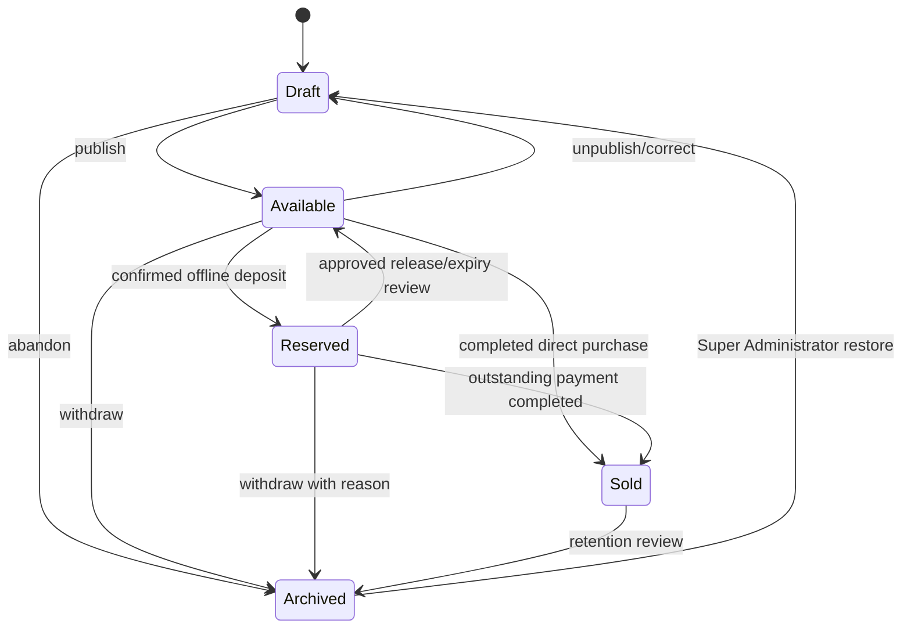

# Logical data model

This is a planning model, not migration syntax. Use MySQL-compatible types, unsigned `BIGINT` internal primary keys, foreign keys, UTC timestamps, `utf8mb4`, and Laravel timestamps. A UUID for cars adds no current value: stable public identity comes from an immutable stock number and slug. Event UUIDs are justified for idempotency.

## Entity map

`cars.primary_image_id` is the single source for primary-image status. It points to an image that belongs to the same car. Do not also maintain an independently editable `car_images.is_primary` flag.

## Core entities and planned fields

### Users

Extend Laravel's existing user record with `role` (`super_administrator` or `inventory_manager`), `is_active`, `last_login_at`, and normal timestamps. Use email as the unique login identifier. Administrators are created only by an authorized Super Administrator or controlled deployment procedure. Deactivate rather than delete users referenced by audit records. MFA-specific fields depend on the selected implementation.

### Catalog taxonomy

| Entity | Fields | Integrity / deletion |
|---|---|---|
| `makes` | `name VARCHAR(100)`, unique `slug VARCHAR(120)`, `is_active`, `sort_order` | Referenced values are deactivated, not deleted |
| `car_models` | `make_id`, `name VARCHAR(120)`, `slug VARCHAR(140)`, `is_active`, `sort_order` | Unique `(make_id, slug)`; model/make consistency required |
| `body_types` | `name VARCHAR(80)`, unique `slug`, `is_active`, `sort_order`, optional curated SEO fields/publication flag | Deactivate when referenced |
| `features` | `name VARCHAR(120)`, unique `slug`, optional `group_name`, `is_active`, `sort_order` | Curated reusable facts; no arbitrary per-car duplicates |
| `car_feature` | `car_id`, `feature_id` | Composite primary/unique key; cascade only with parent car purge |

Make and model are both stored on `cars` for straightforward filters, but their pairing must be consistent. Prefer a database-enforceable composite relationship if implementation remains maintainable; always retain one shared domain validator and tests.

### Cars

| Group | Planned fields and types | Nullability / rule |
|---|---|---|
| Identity | `id BIGINT`, `stock_number VARCHAR(32)`, `slug VARCHAR(190)` | Stock unique/non-null after creation; slug nullable while Draft, unique when present |
| Classification | `make_id`, `car_model_id`, `body_type_id`, `car_stand_id` | Nullable while incomplete Draft; required to publish |
| Naming | `trim VARCHAR(120)` | Nullable |
| Year/price | `year SMALLINT UNSIGNED`, `price_amount BIGINT UNSIGNED`, `currency CHAR(3)` default `NGN` | Required to publish; whole naira, never floating point |
| Usage | `mileage INT UNSIGNED`, controlled `mileage_unit` (`km`/`mi`) | Required; query layer normalizes comparison |
| Specifications | controlled `transmission`, `fuel_type`; nullable `engine`, `drivetrain`; `exterior_colour`, nullable `interior_colour`; controlled `condition` | Search fields are columns; current content uses the approved foreign-used condition label without duplicating marketing copy in every row |
| Description | `description TEXT`, optional controlled `supplemental_specs JSON` | Description required to publish; JSON only for rare non-filterable key/value facts |
| State | controlled `status`, `is_featured BOOLEAN`, nullable `primary_image_id`, nullable validated `video_url` | Status defaults Draft; featured does not override publication |
| SEO | nullable `meta_title VARCHAR(70)`, `meta_description VARCHAR(170)`, exceptional `canonical_override VARCHAR(2048)` | Derived defaults preferred; override requires review |
| Lifecycle | `published_at`, `reserved_at`, `reservation_expires_at`, `sold_at`, `archived_at` | Nullable and consistent with state |
| Ownership | nullable `created_by`, `updated_by`; timestamps; `deleted_at` | Actor may later be deactivated; car uses soft delete |

Negotiable pricing is deferred. If approved later, add a dedicated boolean rather than placing it in JSON. Slugs should include human title plus stock number for collision resistance and remain stable after publication.

#### Stock number

Format: `AM-0001`, `AM-0002`, and so on. Create the row in a transaction, derive the sequence from its database ID (left-pad to at least four digits), save under a unique constraint, and never recycle gaps. The value is immutable for normal administrators. A Super Administrator may correct a proven mistake only through an explicitly authorized, reason-required, audited action that also reviews the slug and external references. Stock number appears on public detail, prefilled WhatsApp text, admin global search, and analytics.

#### Money

`price_amount` stores whole Nigerian naira as an unsigned integer and `currency` stores `NGN`. Validate an approved range. Display with a locale-safe formatter as `₦25,000,000`; do not persist punctuation or symbol.

#### Publication invariant

A car can publish only when it has: stock number; stable slug; matching make/model; year; price/currency; mileage/unit; body type; transmission; fuel type; condition; exterior colour; car stand; meaningful description; and a processed primary image with alt text. Status must become Available and `published_at` must be set in the same transaction. Published public queries also require not soft-deleted and no future `published_at`.

### Car images

Fields: `car_id`, `disk`, unique `path`, sanitized `original_filename`, detected `mime_type`, `width`, `height`, `file_size_bytes`, editable `alt_text`, nullable `caption`, `display_order`, processing status/error, controlled derivative manifest JSON, `created_by`, timestamps, and optional `deleted_at`. Unique `(car_id, display_order)` is maintained transactionally during reorder. `cars.primary_image_id` must reference an active processed image belonging to the same car.

Multiple uploads are staged; successful decoded images are orientation-corrected, metadata-stripped where appropriate, re-encoded, and assigned stable orders. Replacement creates new paths and changes the pointer only after processing succeeds. Deletion cannot remove the current primary without selecting a replacement or unpublishing. Physical purge is delayed and limited to paths owned by the record.

### Car stands

Fields: stable `name` and `slug`; structured address lines plus a display address; nullable approved directions/map URL and coordinates; hours fields/reference to central hours; optional phone override; introduction/access notes; media metadata; SEO fields; `is_active`; timestamps. Seed/import exactly two approved records: Iju and Ogunnisi Road. Unknown location facts stay null.

### Status and audit records

`car_status_histories` is append-only: `car_id`, nullable actor (for a future system action), `from_status`, `to_status`, required reason/category where appropriate, lifecycle snapshot metadata without customer data, and `occurred_at`. It is the authoritative lifecycle trail.

`activity_logs` is broader and append-only: actor, action, subject type/id, sanitized before/after changes, request/correlation ID, optional coarse request metadata subject to retention review, and `occurred_at`. Never record credentials, secret values, uploaded file bytes, or customer conversations. Neither role can edit/delete logs through normal admin UI.

### Content

| Entity | Main fields | Rules |
|---|---|---|
| `buying_guides` | author, title, unique slug, excerpt, sanitized body, status, cover disk/path/alt, SEO, `published_at`, timestamps, soft delete | Draft not public; real author/publisher and visible dates |
| `faqs` | question, sanitized answer, category, sort order, `is_active`, timestamps | Structured records; only approved factual answers |
| `content_pages` | unique fixed `key`, title, summary/body or constrained structured fields, SEO, status, `published_at`, updated_by, timestamps | Core routes only; editors cannot create arbitrary URLs |
| `site_settings` | singleton ID, contact display/E.164 fields, email, hours, social URLs, reservation amount/period, footer defaults, updated_by, timestamps | Typed fields with per-field validation and cache invalidation; secrets excluded |

Testimonials are not a launch table. Add an entity only when genuine approved content, attribution, consent, moderation, and display rules exist.

### Interaction events

Optional first-party events use `event_uuid`, allowlisted `event_name`, nullable `car_id`/`car_stand_id`, `page_type`, `cta_position`, small allowlisted metadata JSON, consent state, and `occurred_at`. They contain no name, email, phone, message, destination URL, raw search, IP, or full user agent. Retention is blocked on privacy approval. See [analytics-events.md](analytics-events.md).

## Lifecycle

Never restore Sold directly to Available. Every arrow is a named, authorized action with validation, actor/reason, synchronized timestamp changes, status history, and activity log. Unpublishing changes Available to Draft and removes public access without erasing history. Reservation expiry initially creates an overdue alert; an administrator confirms release and no automatic financial action occurs.

| Status | Public detail | Active `/cars` | Required timestamps |
|---|---|---|---|
| `draft` | No (404) | No | none; `published_at` null after unpublish |
| `available` | Yes | Default | `published_at`; reservation fields clear |
| `reserved` | Yes | Explicit filter only | `published_at`, `reserved_at`, `reservation_expires_at` |
| `sold` | Yes initially | No | `published_at`, `sold_at`; availability markup OutOfStock |
| `archived` | No | No | `archived_at`; previous public URL 410/approved redirect |

## Indexes and query integrity

Minimum candidates, to verify with representative `EXPLAIN` rather than add blindly:

- Cars: unique `stock_number`, unique nullable `slug`; `(status, published_at, id)`; `(status, make_id, price_amount)`; `(status, car_model_id)`; `(status, body_type_id, price_amount)`; `(status, car_stand_id)`; `(status, year)`; `(status, mileage)`; `(status, transmission)`; `(status, fuel_type)`; `(is_featured, status, published_at)`; `(status, reservation_expires_at)`.
- Models: unique `(make_id, slug)` and index `(make_id, is_active)`.
- Images: unique `(disk, path)`, unique `(car_id, display_order)`, and index processing status.
- Pivot: unique `(car_id, feature_id)` and reverse index `(feature_id, car_id)`.
- Guides: unique slug and `(status, published_at)`.
- Events: unique `event_uuid`, `(event_name, occurred_at)`, `(car_id, event_name, occurred_at)`.
- History/activity: `(car_id, occurred_at)` or `(subject_type, subject_id, occurred_at)` plus actor/time.

Foreign-key deletion choices must be explicit. Restrict taxonomy/stand/user deletion when referenced; soft-delete cars/guides; cascade pivot and image metadata only during an authorized final car purge; set nullable actor references to null while preserving actor snapshots in audit data where required.
