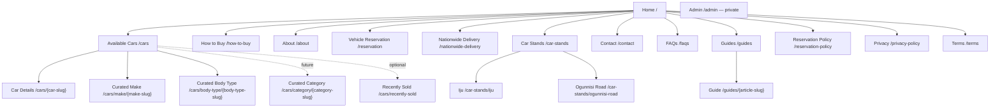

# Sitemap and navigation

## Public hierarchy

## Page contract

“Self” means the clean absolute production URL. Only pages that pass their publication gate enter navigation or XML sitemaps.

| Page / route | Purpose, audience, primary CTA | Required content and source | Indexation / canonical / schema | Empty or unavailable state |
|---|---|---|---|---|
| Home `/` | Establish trust for all visitors; **Browse Cars**, **WhatsApp Us** | Approved identity, Available/featured cars, buying and delivery summary, both car stands; settings + inventory | Index; self; `Organization` when facts/assets qualify | Honest no-inventory message and contact actions |
| Available Cars `/cars` | Find and compare current inventory; **View Details** | Published cars, taxonomies and car stands | Clean page index; self; breadcrumb | Distinguish globally empty from filtered zero results |
| Car detail `/cars/{car-slug}` | Evaluate one car; **Call** or **WhatsApp** | Actual car, media, price, status, stand, specifications, reservation/delivery facts | Available/Reserved/Sold index initially; self; `Product` + `Car`, `Offer`, breadcrumb | Draft 404; Sold 200; Archived 410 or deliberate relevant redirect |
| Make landing `/cars/make/{make-slug}` | Curated search intent; **View Available Cars** | Available cars + unique approved introduction, metadata, links | Index only when non-empty and substantive; self; breadcrumb | Known empty: 200 `noindex,follow`; unknown: 404 |
| Body-type landing `/cars/body-type/{body-type-slug}` | Curated body-style intent | Same publication gate as make | Same as make | Same as make |
| Selected category `/cars/category/{category-slug}` | Future manually curated high-value category | Unique content and a reviewed inventory rule | Deferred; never generated for arbitrary filters | 404 until explicitly published |
| Recently Sold `/cars/recently-sold` | Optional inventory-history collection | Genuine Sold records + useful contextual copy | Deferred; index only if sustained value exists | 404 until enabled; no placeholder |
| About `/about` | Explain identity and since-2023 history; **Browse Cars** | Approved facts + fixed-key About content | Index; self; organization/breadcrumb | Never invent statistics, people, or history |
| How to Buy `/how-to-buy` | Explain enquiry, inspection, reservation, completion and delivery; **Browse Cars** | Approved structured process copy | Index; self; breadcrumb | No unsupported transaction step |
| Reservation `/reservation` | Explain the ₦500,000, 14-day arrangement; **Speak with our team** | Central settings + approved policy | Index; self; breadcrumb | Full non-refundable/forfeiture wording stays prominent |
| Nationwide Delivery `/nationwide-delivery` | Explain delivery within Nigeria; **Confirm delivery cost** | Approved fixed-key delivery content | Index; self; breadcrumb | Never claim a fixed or free cost |
| Car Stands `/car-stands` | Compare locations; **View Car Stand** / **Directions** | Two approved stand records and hours | Index; self; organization/location graph | Both approved car stands remain represented |
| Iju `/car-stands/iju` | Plan a visit; **Directions**, **Call** | Exact address, hours, assigned cars and genuine media | Index; self; `AutoDealer`, breadcrumb | No invented coordinates/map details |
| Ogunnisi Road `/car-stands/ogunnisi-road` | Plan a visit; **Directions**, **Call** | Exact approved address, hours, assigned cars and media | Same as Iju | Same as Iju |
| Contact `/contact` | Reach Auto Mercy; **WhatsApp**, **Call**, **Directions** | Single settings source: phone 08061731673, email, hours, stands | Index; self; organization/location nodes for visible approved facts | Keep visible local contact; deep links wait for approved production format |
| FAQs `/faqs` | Answer genuine buying/visit/reservation/delivery questions | Published FAQ rows | Index when substantive; self; breadcrumb; omit `FAQPage` at launch | No rows: 200 `noindex` or keep unpublished |
| Guides `/guides` | Discover buying advice; **Read Guide** | Published guide records | Index when articles exist; self; breadcrumb | No articles: 200 `noindex`; no placeholders |
| Guide `/guides/{article-slug}` | Give useful buying guidance | Published article, real author/publisher and dates | Index; self; `Article`, breadcrumb | Draft/unknown: 404 |
| Reservation Policy `/reservation-policy` | Authoritative reservation terms | Approved fixed-key policy | Index; self; breadcrumb | Do not publish incomplete wording |
| Privacy `/privacy-policy` | Explain actual data handling | Approved legal text | Public/index when approved; self; breadcrumb | Do not publish a fabricated policy |
| Terms `/terms` | State approved terms | Approved legal text | Public/index when approved; self; breadcrumb | Same publication gate |
| Admin `/admin` | Manage application data | Filament resources and policies | Private; `noindex,nofollow`; no canonical/sitemap | Future login flow; unauthorized request 403 |

## Primary navigation

Desktop order:

1. Home
2. Available Cars
3. How to Buy
4. About
5. Car Stands
6. Contact
7. WhatsApp Us (visually distinct action)

The header is sticky only after the initial header boundary. It keeps a stable compact height and never shifts content. Home uses exact active matching; Cars, Car Stands, and Guides use section-prefix matching. The WhatsApp action reports its destination and opens according to user expectations.

Mobile menu order is Home, Available Cars, How to Buy, About, Car Stands, Contact. The button exposes name/state; the menu traps focus while modal, closes on Escape, locks background scrolling, and restores focus to its trigger. Persistent mobile actions expose no more than two actions at once; on a car detail page these are Call and WhatsApp. Browse Cars remains readily available in header/menu. Respect safe-area insets and reserve bottom content space.

## Footer hierarchy

| Group | Links/content |
|---|---|
| Browse | Available Cars; qualified make/body-type landings; Guides when published |
| Visit & Contact | Car Stands, Iju, Ogunnisi Road, Contact, local phone/email, Monday–Saturday 8:00 AM–6:00 PM |
| Company | About, How to Buy, Reservation, Nationwide Delivery, FAQs |
| Legal | Reservation Policy, Privacy Policy, Terms |

The footer identifies Auto Mercy and the legal name, including CAC 7328497 where approved. Social links appear only after canonical URLs are confirmed. Values come from settings/car-stand data rather than repeated template text.

## Breadcrumbs

- Home has no breadcrumb.
- All lower-level public pages have a visible trail that represents a useful user path.
- Examples: Home → Available Cars → car title; Home → Available Cars → Toyota Cars; Home → Car Stands → Iju Car Stand; Home → Car Buying Guides → article title.
- The last item is plain text with `aria-current="page"`; prior items are links.
- Visible breadcrumbs and `BreadcrumbList` JSON-LD must agree exactly.

## Content ownership and publication gates

Vehicle/card content is derived from published car records. Addresses are owned by `car_stands`. Contact, hours, social links, and reservation values come from typed site settings. Long-form core pages use fixed-key `content_pages`; FAQs and guides use their own records. Metadata is derived by default and may have reviewed per-record overrides.

An SEO landing page is publishable only with Available inventory, a unique heading and introduction, unique metadata, useful internal links, and meaningful customer value. Arbitrary query combinations never become landing pages. Legal/policy changes require business approval before publication.
